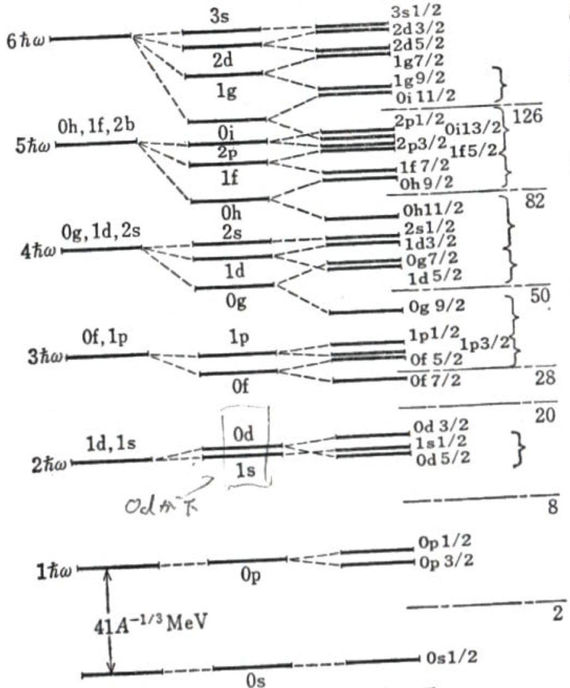
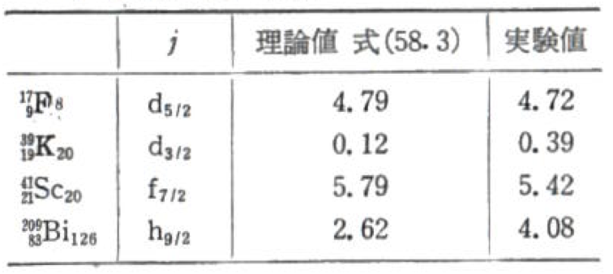
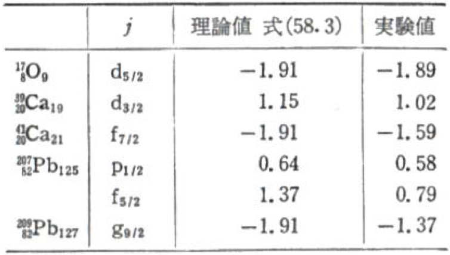
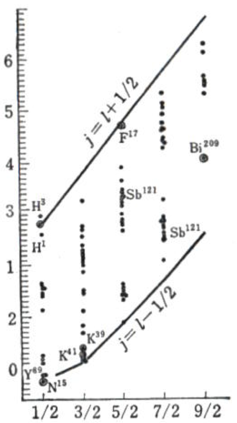
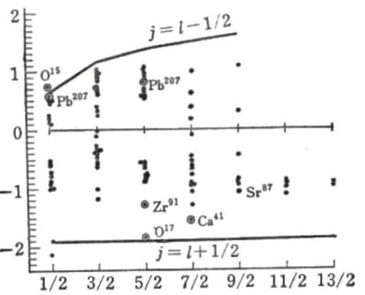

# A3レポート

杉浦寛行 0500326750

## 1. 原子核の殻構造

原子は、その電子が殻構造を持つことが知られている。原子核を構成している核子に関しても同様の構造が考えられる。
このレポートでは、この原子核の殻模型について調べ、まとめたものになる。

## 2. 概要

まずはじめに殻模型に関する概要を述べる。原子核は初め、液滴として扱われていた。
これは原子核を液滴として捉える半経験的質量公式が高い精度で結合エネルギーを予言できていたから。
一応1930年ごろに原子核が原子のような殻構造を持つ可能性についての議論はあったが、
原子にとっての原子核のような存在が原子核にはないこと、核子の間には強い相互作用が働いていること、
核分裂を簡単に説明できることから、 依然として液滴として扱われていた。
しかし、1940年代に多くの原子核の結合エネルギーが測定され、
そのパターンを分析したメイヤーとイェンゼンは魔法数を発見した。[^b]
この魔法数の存在により、原子核は原子のような核構造を持つことが示された。

[^b]: <http://www.th.phys.titech.ac.jp/~muto/lectures/INP02/INP02_chap05.pdf>

## 3. 魔法数

先程、原子核を液滴として捉える半経験的質量公式が高い精度で結合エネルギーを予言できていたことを述べた。
半経験的公式は、具体的には
$$BE(A)=a_vA+a_sA^{2/3}+a_{sym}\frac{(N-Z)^2}{2A}+\frac{a_cZ^2}{A^{1/3}}+\Delta$$
ここで、Aは質量数、Nは中性子数、Zは陽子数、BEは結合エネルギー、
$a_v$,$a_s$,$a_{sym}$,$a_c$は定数、
$\Delta$は、偶偶核では$\delta$、奇奇核では$-\delta$、奇核では0となる。$\delta=-130/AMeV$程である。
これらの定数を、実験値似合うように調整することで、例えば
$$a_v=15.56MeV, \quad a_s=-17.23MeV, \quad a_{sym}=-46.57MeV, \quad a_c=-0.697MeV$$
とすると(出典[^a] 165p)、原子核の結合エネルギーは、実測値と理論値がほぼ一致する。

しかし、ある特定の場合において、実測値と理論値がずれていることがわかった。

> 図1　出典[^a] 165p　図57.1

[^a]: 有馬朗人著　「原子と原子核」

図1の横軸はKr原子核の質量数、縦軸は原子核の 結合エネルギーの半経験的公式の値 -実測値である。
特徴的なのは、N(中性子数)=50の時、縦軸の値が負になる。
これは、理論値よりも実測値が大きいことを示している。つまり、液滴模型より安定する。

> 図2 出典[^a] 166p 図57.2

図２の縦軸はN=50,Z=36付近の原子核の第一励起エネルギー、横軸は原子核の中性子数を示している。
図１と同様に、N=50付近で 第一励起エネルギーが大きくなる ことがわかる。
また、N=82でも第一励起エネルギーが大きくなることがわかる。

> 励起エネルギーが大きい事は何を意味しているのだろうか。
> 励起とは、あるエネルギーの低い状態からより高い状態に遷移することだった。
> 励起エネルギーはそのために必要になるエネルギーのこと。
> 元の状態が安定な場合、安定という事は、ちょっとやそっとのエネルギーでは状態が変わらない。
> より多くのエネルギーが遷移のために必要になる。
> つまり、励起エネルギーが大きいということは、その状態が安定ということだった。
> 例えば、第一励起エネルギーは基底状態から第一励起状態に遷移するために必要なエネルギー。
> それが大きいということは、その基底状態が安定であるということ。

このような情報から魔法数は導かれる。 具体的には2,8,20,28,50,82,126が魔法数と呼ばれている。
陽子もしくは中性子の数がこれらの数になると、原子核の結合エネルギーが大きくなり、
液滴模型とのズレが大きくなる。

この魔法数は原子にも存在し、それは電子の殻構造として説明出来た。
例えば、周期表18族の貴ガスは、化学的に非常に安定していることが知られている。
これは、最外殻が閉殻となっているため、反応性が低いからである。

つまり魔法数の存在は、原子核にも殻構造が存在しうることを強く示している。

## 4. 核内のポテンシャル

核内に働く強い力は十分に距離が近くないと働かない。 ある距離を超えると、急速に弱くなる。
したがって、核子に働く核力はその核子の周辺での密度 $\rho(r)$ に比例する。
ここで、ある核子に働くポテンシャルを $V(r)=V_0 \rho(r)$とする。 $\rho(r)$
は原子核内部でほぼ一定、表面では急速に減少する。
これは、原子核の表面では、ある核子に接する核子が原子核の内側に制限されるからである。

> 図3 出典[^a] 166p 図57.3

図３は、上記のような $\rho(r)$の場合の $V(r)$のグラフの概形である。
これを近似して、調和振動子ポテンシャルとして扱う。つまり
$$V(r)=-V_0+\frac{m\omega^2r^2}{2}$$
ここで
$-V_0$は、定数、mは核子の質量、$\omega$は調和振動子の角速度である。

核子がこのポテンシャル内で運動しているとすると、そのシュレディンガー方程式は
$$(-\frac{\hbar^2}{2m}\nabla^2-V_0+\frac{m\omega^2r^2}{2})\phi(r)=E\phi(r)$$
となる。$r^2=x^2+y^2+z^2$なので、この方程式は、各方向に分けることができる。
変数分離できると仮定して、

> 具体的には、
> $$(-\frac{\hbar^2}{2m}\frac{\partial^2}{\partial x^2}-V_{0_x}+\frac{m\omega^2x^2}{2})\phi(x^2)=E_x\phi(x^2)$$
> $$(-\frac{\hbar^2}{2m}\frac{\partial^2}{\partial y^2}-V_{0_y}+\frac{m\omega^2y^2}{2})\phi(y^2)=E_y\phi(y^2)$$
> $$(-\frac{\hbar^2}{2m}\frac{\partial^2}{\partial z^2}-V_{0_z}+\frac{m\omega^2z^2}{2})\phi(z^2)=E_z\phi(z^2)$$
> また、
> $$E=E_x+E_y+E_z$$
> $$V_0=V_{0_x}+V_{0_y}+V_{0_z}$$

Vは調和振動子ポテンシャルなので、各方向の１次元調和振動子の固有関数を
$\phi_{n_x}(x)$、$\phi_{n_y}(y)$、$\phi_{n_z}(z)$とすると、
$$\phi(r)=\phi_{n_x}(x)\phi_{n_y}(y)\phi_{n_z}(z)$$
$$\epsilon=(N_0+3/2)\hbar\omega$$
$$N_0=n_x+n_y+n_z$$
とわかる。

ここで、 $N_0=0$、つまり$(n_x,n_y,n_z)=(0,0,0)$の時、エネルギー状態が最も低くなる。この軌道に、同じ向きのスピンを持った核子が２個入る。
スピンの向きは上向き、下向きの二通りなので2が魔法数であると分かる。
次に $N_0=1$の場合、(1,0,0),(0,1,0),(0,0,1)の３つの状態で縮退しているので、
スピンの上下も組み合わせると、この軌道には核子が６個入れる。
よって、2+6=8が魔法数になる。
同様の議論を繰り返すと、20,40,70,112が魔法数として予言される数である。

しかし、これは先程列挙したものとは異なる。

## 5. 核内のスピン軌道力

したがって、ここからは、何故そのような違いが生じるのかについて考えていきたい。
まず、魔法数を説明する際に、スピン軌道力が重要になる。
スピン軌道力とは、スピン軌道相互作用とも言われる。

> 出典[^c] 
> 電子は質量、電荷の他に, スピン角運動量という粒子固有な物理量を持っている。
> スピン角運動量は磁場に応答する磁気モーメントの起源であり、
> 電子は磁場中で２つの異なったエネルギー状態に分離している。
> 一方、電荷をもつ電子が、軌道運動することにより、この軌道電流が磁場を生み出す。
> したがって、電子のスピン磁気モーメントは、軌道電流の生み出す磁場と互いに相互作用（力）をおよぼし合う。
> 軌道電流は電子の軌道角運動量に置き換えて述べることができて、
> この相互作用は、スピン軌道相互作用と呼ばれている。

[^c]: http://cphys.s.kanazawa-u.ac.jp/20090303press/soi.html

このようにスピン軌道相互作用は電子に対してよく適用される力で、
これまでは核力のみを考え、スピン軌道力を無視していた。
なので、まずスピン軌道力が原子核内でも無視できないと仮定する。

スピン軌道力は$\xi(l\cdot s)$と表される。ここで、lは軌道角運動量、sはスピン。
簡単のため、$\xi=const$として考える。
すると、核子のシュレティンガー方程式は
$$\{-\frac{\hbar^2}{2m}\nabla^2+\frac{m\omega^2}{2}r^2+a\bf{l}^2+\xi(l\cdot s)\}\varphi(r)=\varepsilon\varphi(r)$$
になる。ここで、$a$は定数である。
この式の固有状態は、$n,l,m,j=l\pm 1/2$これらの固有値で表される。

|  l  |  j  |                 m                 |
| :-: | :-: | :-------------------------------: |
|  3  | 7/2 | $\pm 7/2,\pm 5/2,\pm 3/2,\pm 1/2$ |
|     | 5/2 |     $\pm 5/2,\pm 3/2,\pm 1/2$     |

> 表１ N=3の軌道のl,j,m

固有値は$j=l+1/2$のとき、

$$\varepsilon_{nlj}=(2n+l+3/2)\hbar\omega+al(l+1)+\xi\frac{l}{2}$$

$j=l-1/2$のとき、

$$\varepsilon_{nlj}=(2n+l+3/2)\hbar\omega+al(l+1)-\xi\frac{l+1}{2}$$
なぜ場合分けが必要になるのかと言うと、
$j=l+s=l\pm 1/2$だったので、
$$j^2=l^2+s^2+2l\cdot s$$
$$j(j+1)=l(l+1)+\frac{1}{2}\times\frac{3}{2}+2l\cdot s $$
$$l\cdot s=\frac{1}{2}\{j(j+1)-l(l+1)-\frac{3}{4}\}$$
つまり、
$$l\cdot s=
\begin{cases}
-\frac{1}{2}(l+1) & j=l-1/2 \\
\frac{1}{2}l & j=l+1/2
\end{cases}$$
また、$\bf{l}^2$の絶対値は、古典的には$l^2$となるが、量子的効果により、$l(l+1)$となる[^d]。

[^d]: 有馬朗人著　「原子と原子核」 85p

原子では、$\xi>0$となっていて$j=l-1/2$の場合の方が低い。
一方原子核では$\xi<0$となっていて、$j=l+1/2$の場合の方が低い。
ここで、$N_0=3$の軌道は、$0f_{7/2}, 1p_{3/2}, 1p_{1/2}, 0f_{5/2}$の４つである。

> ここでの、各軌道に添えられている添字は、jの値を表している。

これらの中で最も低いのは$0f_{7/2}$。
表より、$j=7/2$の時、$m=\pm 7/2,\pm 5/2,\pm 3/2,\pm 1/2$なので、核子は8個入る。
N=2までで20個、それに、この軌道の8を足すと28個が魔法数となる。

N=3以降についてはどうだろう。

> 図４ 出典[^a] 170p 図57.6

図４の左側の各線は、調和振動子の固有状態をエネルギーが低い順から並べたもの。
そこから更に、lの値によって、場合分けが生じる。
具体的には$al(l+1)$の項が、変わってくるので、その分岐が中央の線になっている。
そこからjの値によって、場合分けが生じる。

ここで、図４を参考にするとN=4の時、0g軌道がスピン軌道力により$0g_{9/2},0g_{7/2}$の2つに分裂する。
このとき、

$0g_{9/2}$は、N=3の$0f_{5/2}$, $1p_{1/2}$

と同じくらい低い。
N=3が閉じると核子数は40、$0g_{9/2}$が閉じると核子数は50となる。
よって魔法数は50となる。
同様にして、82,126が魔法数であることがわかる。

## 6. 原子核の磁気モーメント

このように、スピン軌道力を考慮すると魔法数を説明できることがわかった。
ここでのスピン軌道力の起源は、２体の核力にあるスピン軌道力と考えられている。

| $^{41}Ca \quad 7/2$ | $^{42}Ca \quad 0$ | $^{43}Ca \quad 7/2$ | $^{44}Ca \quad 0$ |
| ------------------- | ----------------- | ------------------- | ----------------- |
| $^{45}Ca \quad 7/2$ | $^{46}Ca \quad 0$ | $^{47}Ca \quad 7/2$ | $^{48}Ca \quad 0$ |
| $^{49}Ca \quad 3/2$ | $^{50}Ca \quad 0$ |                     |                   |

> 表２ Ca同位体のスピン

表２には元素番号20ばんのカルシウムの同位体のスピンを示してある。
$^{41}Ca$は中性子を21個含む。
20個は閉殻を作り、21番目は図４より$0f_{7/2}$軌道に入る。
ここで、閉殻の角運動量は0なので、$^{41}Ca$のスピンは7/2となる。
$^{42}Ca$は核子を42個含む。
２つの陽子、中性子の間には対相互作用が働き、角運動量が0になる。
従って、$^{42}Ca$のスピンは0となる。
一般に核が偶数個の中性子を含む場合、それらは角運動量が０になるように結合する。
奇数個の場合は、一個を除いて０になる。原子核のスピンはこの残りの中性子の角運動量に等しい。

このように、原子核のスピンも、殻模型によって説明できることがわかった。
では、原子核のスピンはどのように測定するのだろう。

原子の電子群の持つ全角運動量を$J$とする。これは全スピンと全軌道角運動量の和である。
原子核のスピンを$I$とし、$|I|\le |J|$とする。
原子の全角運動量FはJとIの和である。その大きさは
$F=J+I,J+I-1..J-I$。$I\ne 0$の時、原子核は磁気双極子モーメント$\mu_N$を持つ。
電子群が作る磁場と原子核の磁気モーメントに間に$J\cdot I$に比例した相互作用がある。
この力の影響でFが異なる状態は異なるエネルギーを持ち、僅かにエネルギー準位が分裂する。
これを超微細構造という。
ある電子状態Jから生じる準位の分裂は2I+1個ある。従って原子核のスピンIがわかる。
このように、超微細構造を調べることによって原子核のスピンを測定することができる。
これは$|J|\le |I|$の場合には用いられない。

同じJ,Iを持つ異なるF状態間のエネルギー分離の大きさは、原子核の磁気双極子モーメント$\mu_N$に比例する。
電子の磁気モーメントの単位となるボーア磁子は$e\hbar/(2mc)(=9.2741\times 10^{-21})$程である。
原子核の磁気モーメントの単位の核磁子は$\mu_N=e\hbar/(2Mc)=3.22\times 10^{-12}$と、かなり小さい。
陽子と中性子の磁気双極子モーメントは、核磁子単位で
$$\mu=
\begin{cases}
2.79 & \text{陽子}\\
-1.91 & \text{中性子}
\end{cases}
$$
である。

これらの測定値は核子が軌道角運動量を持つことを考慮していない。
これらの値はスピン角運動量sによる。
核内で核子は軌道角運動量を持つ。
ここで、一つの核子が核内で持つ磁気双極子モーメントは
$$\mu=(g_ss+g_ll)\frac{e\hbar}{2Mc}$$
と表される。$g_s,g_l$はそれぞれ
$$g_s=
\begin{cases}
5.585 & \text{陽子}\\
-3.826 & \text{中性子}
\end{cases},
g_l=
\begin{cases}
1 & \text{陽子}\\
0 & \text{中性子}
\end{cases}
$$
である。
原子核全体の磁気双極子モーメントは、全核子の$\mu$の和である。
ただし、前にも述べたように、偶数個の陽子、中性子が角運動量0になるように結合すると磁気モーメントも0になる。
実際、偶偶核のスピン、磁気モーメントは0。
そこで、奇核の時期双極子モーメントは最外核子によるもののみとしてみる。
最外核子がnljという軌道にいるとする。
磁気モーメント$\mu$と磁場$H$の相互作用によって生じるエネルギーは磁気の方向をz軸に選ぶと
$$\Delta E=H_z\mu_z$$
そこで、$\mu_z$を計算すれば良い。

$\mu$をj方向とそれに垂直な成分$\mu_{\perp}$に分解し
$$\bm{\mu}=\frac{\bm{\mu} \bm{j}}{j(j+1)}\bm{j}+\bm{\mu}_{\perp}$$
と書く。$\bm{\mu}=(g_s-g_l)\bm{s}+g_l\bm{j}$を用いると
$$\mu\bm{j}=(g_s-g_l)(\bm{s}\bm{j})+g_lj(j+1)$$
これは、$\bm{S}\cdot\bm{J}=\frac{J(J+1)+S(S+1)-L(L+1)}{2}$を用いると、
$$\bm{\mu}\bm{j}=\frac{1}{2}(g_s-g_l)\{j(j+1)+\frac{3}{4}-l(l+1)\}+g_lj(j+1)$$
となる。
モーメントとしては、一般に状態をm＝jとなるように値を取るので$j_z$の期待値としてjを、
また$\bm{\mu}\bm{j}$に関する変形と$j=l\pm 1/2$も用いて整理すると、
$$\mu_s\equiv\mu_z=j\{g_l\pm\frac{g_s-g_l}{2l+1}\}$$
と書ける。この$\mu_s$をシュミット値と呼ぶ。

中性子も陽子も共に閉殻を作っている原子核を２重閉殻な原子核という。

> 図５　出典[^a] 174p

> 図6　出典[^a] 174p

図５は２重閉殻核に1個の陽子がついた原子核の、図６は一個の中性子がついた原子核の時期双極子モーメントを示している。
シュミット値は実験値にかなりよく合致することが分かる。

>図７ 出典[^a] 174p

>図８　出典[^a] 174p

また、図７・8には奇核の磁気双極子モーメントの測定値がスピンj毎にプロットされている。
縦軸は$\mu$、横軸は$j$。
図８・７を見ると、実験値が$j=l\pm 1/2$の間に挟まれていることが分かる。

## 7. 57Feおよび111Cdの磁気モーメント

<!--
A3の実験で測定する予定だった 57Feおよび111Cd核の磁気モーメントの文献値を調べ、その値に関して殻模型の観点から自分なりに考察して下さい。-->

## 8. まとめ

原子核の殻構造について、魔法数に関する事柄を中心にまとめた。
まず魔法数というものの存在について、次に、その由来を強い力を通して説明しようと試みた。
しかし、強い力だけでは魔法数を説明できないことがわかった。
そこで、スピン軌道相互作用も考慮した結果、魔法数を説明することができた。

---

出典
