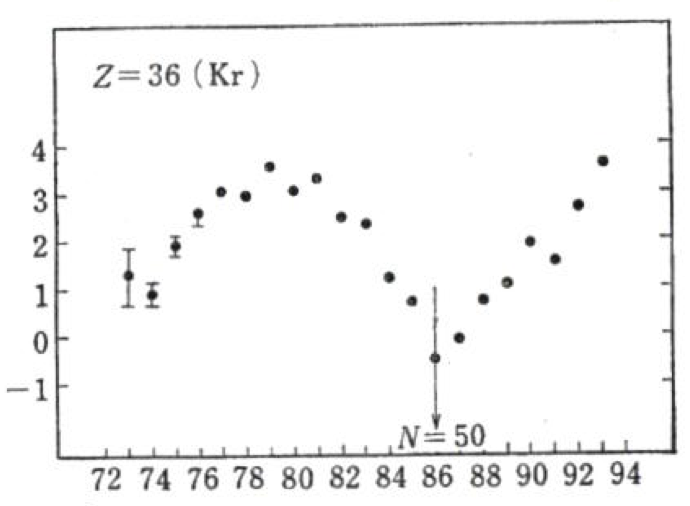
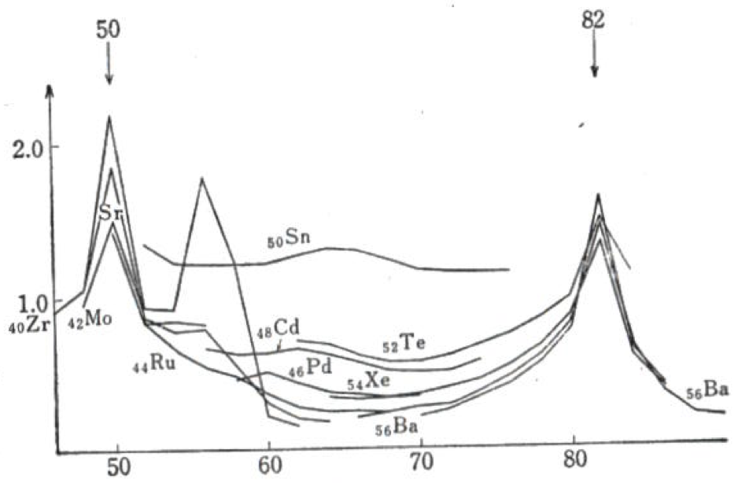
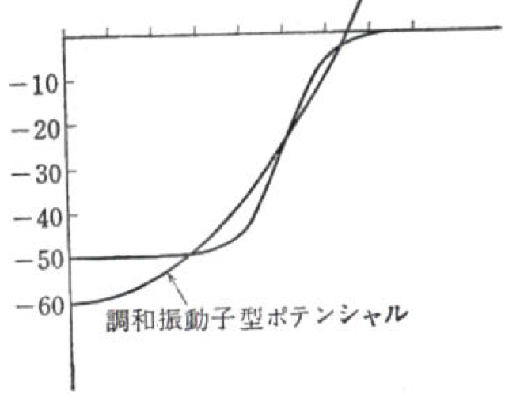

# A3レポート

杉浦寛行 0500326750

## 1. 原子核の殻構造

原子は、その電子が殻構造を持つことが知られている。原子核を構成している核子に関しても同様の構造が考えられる。
このレポートでは、この原子核の殻模型について調べ、まとめたものになる。

## 2. 概要

まずはじめに殻模型に関する概要を述べる。原子核は初め、液滴として扱われていた。
これは原子核を液滴として捉える半経験的質量公式が高い精度で結合エネルギーを予言できていたから。
一応1930年ごろに原子核が原子のような核構造を持つ可能性についての議論はあったが、
原子にとっての原子核のような存在が原子核にはないこと、核子の間には強い相互作用が働いていること、
核分裂を簡単に説明できることから、 依然として液滴として扱われていた。
しかし、1940年代に多くの原子核の結合エネルギーが測定され、
そのパターンを分析したメイヤーとイェンゼンは魔法数を発見した。[^b]
この魔法数の存在により、原子核は原子のような核構造を持つことが示された。

[^b]: <http://www.th.phys.titech.ac.jp/~muto/lectures/INP02/INP02_chap05.pdf>

## 3. 魔法数

> 図1　出典[^a] 165p　図57.1

[^a]: 有馬朗人著　「原子と原子核」

図1の横軸はKr原子核の質量数、縦軸は原子核の結合エネルギーの理論値-実測値である。
特徴的なのは、N(中性子数)=50の時、縦軸の値が負になる。
これは、理論値よりも実測値が大きいことを示している。つまり、液滴模型より安定する。

> 図2 出典[^a] 166p 図57.2

図２の縦軸はN=50,Z=36付近の原子核の第一励起エネルギー、横軸は原子核の中性子数を示している。
図１と同様に、N=50付近で第一励起エネルギーが大きくなることがわかる。
また、N=82でも第一励起エネルギーが大きくなることがわかる。

このような情報から魔法数は導かれる。 具体的には2,8,20,28,50,82,126が魔法数と呼ばれている。
陽子もしくは中性子の数がこれらの数になると、原子核の結合エネルギーが大きくなり、
液滴模型とのズレが大きくなる。

この魔法数は原子にも存在し、それは電子の殻構造として説明出来た。
つまり魔法数の存在は、原子核にも殻構造が存在しうることを強く示している。

## 4. 核内のポテンシャル

核内に働く強い力は十分に距離が近くないと働かない。 ある距離を超えると、急速に弱くなる。
したがって、核子に働く核力はその核子の周辺での密度 $\rho(r)$ に比例する。
ここで、ある核子に働くポテンシャルを $V(r)=V_0 \rho(r)$とする。 $\rho(r)$
は原子核内部でほぼ一定、表面では急速に減少する。
これは、原子核の表面では、ある核子に接する核子が原子核の内側に制限されるからである。

> 図3 出典[^a] 166p 図57.3

図３は、上記のような $\rho(r)$の場合の $V(r)$のグラフの概形である。
これを近似して、調和振動子ポテンシャルとして扱う。つまり
$$V(r)=-V_0+\frac{m\omega^2r^2}{2}$$
ここで
$-V_0$は、定数、mは核子の質量、$\omega$は調和振動子の角速度である。

核子がこのポテンシャル内で運動しているとすると、そのシュレディンガー方程式は
$$(-\frac{\hbar^2}{2m}\nabla^2-V_0+\frac{m\omega^2r^2}{2})\phi(r)=E\phi(r)$$
となる。$r^2=x^2+y^2+z^2$なので、この方程式は、各方向に分けることができる。

> 具体的には、
> $$(-\frac{\hbar^2}{2m}\frac{\partial^2}{\partial x^2}-V_0+\frac{m\omega^2x^2}{2})\phi(x)=E\phi(x)$$
> $$(-\frac{\hbar^2}{2m}\frac{\partial^2}{\partial y^2}-V_0+\frac{m\omega^2y^2}{2})\phi(y)=E\phi(y)$$
> $$(-\frac{\hbar^2}{2m}\frac{\partial^2}{\partial z^2}-V_0+\frac{m\omega^2z^2}{2})\phi(z)=E\phi(z)$$

したがって、変数分離できると仮定して、
$$\phi(r)=\phi_{n_x}(x)\phi_{n_y}(y)\phi_{n_z}(z)$$
$$\epsilon=E+V_0=(N_0+3/2)\hbar\omega$$
$$N_0=n_x+n_y+n_z$$
とわかる。

ここで、 $N_0=0$の時、エネルギー状態が最も低くなる。この軌道に、同じ向きのスピンを持った核子が２個入る。
スピンの向きは上向き、下向きの二通りなので2が魔法数であると分かる。
次に $N_0=1$の場合、(1,0,0),(0,1,0),(0,0,1)の３つの状態で縮退しているので、
スピンの上下も組み合わせると、この軌道には核子が６個入れる。
よって、2+6=8が魔法数になる。
同様の議論を繰り返すと、20,40,70,112が魔法数として予言される数である。

しかし、これは先程列挙したものとは異なる。

## 5. 調和振動子の量子状態

したがって、ここからは、何故そのような違いが生じるのかについて考えていきたい。

中心力ポテンシャル下でのシュレディンガー方程式を考える。
この時、方程式の固有状態は球座標を用いて表すことができる。
その量子数は、動径方向の波動関数の接点の数n、起動角運動量l、そのz成分m。
$(n_x,n_y,n_z)=(0,0,0)$となる状態
$\phi_{000}$は$exp(-\nu r^2/2), (\nu=m\omega\hbar)$